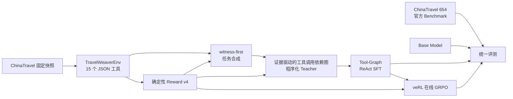
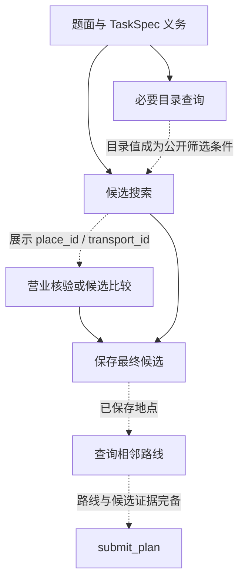

# TravelWeaver: Training Long-Horizon Travel Agents with Tool-Graph SFT and Online RL

<div align="center">

面向长程旅行规划 Agent 的确定性交互与训练框架

<br />

[](https://www.python.org/)
[](https://openreview.net/forum?id=0YRVlxY9BH)
[](docs/tool-call-graph-sft.md)
[](https://github.com/volcengine/verl)
[](https://huggingface.co/Qwen/Qwen3.5-4B)

<br />

**Long-Horizon Travel Agent｜动作策略免蒸馏的 Tool-Graph SFT｜在线 GRPO**

</div>

TravelWeaver 在 [ChinaTravel](https://github.com/LAMDA-NeSy/ChinaTravel) 的官方数据和交互式
旅行规划沙箱基础上重新工程化。它让模型真正搜索交通、景点、酒店和餐厅，保存候选、查询路线，
最后提交一份有证据支撑的多日计划。

本项目的重点不只是把 Long-Horizon Agentic RL 跑起来，而是回答一个更具体的问题：

> 长程 Function Calling Agent 的 SFT 数据，是否可以不依赖更强教师模型自由 rollout，而由环境、
> 可行 witness 和证据驱动的工具调用依赖图直接构造？这样的数据能否真正建立 Agent 能力，
> 并继续被在线 RL 改进？

当前实验给出的答案是肯定的：Qwen3.5-4B Base 在 654 道 ChinaTravel 官方测试题上严格通过率为
0%；经过 1,500 条 Tool-Graph ReAct SFT 后达到 46.48%；继续在线 GRPO 后达到 54.89%。

## Highlights

### 1. 真正的 Long-Horizon Travel Agent：长链工具调用仍能稳定闭环

ChinaTravel 不是普通的文本行程生成。Agent 需要在一个 episode 中连续理解跨日约束，搜索交通、
景点、酒店和餐厅，比较并保存候选，为相邻地点补齐路线证据，最后提交满足时序、预算和用户要求的
结构化计划。TravelWeaver 提供 15 个 JSON 工具，允许每个 episode 最多执行 50 个有效工具动作，
并要求模型在整条轨迹中持续遵守实体可见性和证据契约。

在 654 道 ChinaTravel 官方题目上，训练后的 Agent 已经能够稳定完成这种长链交互：

| 长程交互指标 | Qwen3.5-4B Base | Tool-Graph SFT | GRPO |
|---|---:|---:|---:|
| 平均环境动作数（每轮一个工具） | 31.43 | 19.43 | **18.60** |
| 环境动作数 P90 | 47 | 27 | **26** |
| 发起 `submit_plan` | 262（40.06%） | 643（98.32%） | **649（99.24%）** |
| 正常 `plan_submitted` | 1（0.15%） | 441（67.43%） | **549（83.94%）** |
| 模型自由停止（无终止动作） | 311（47.55%） | **0（0.00%）** | **0（0.00%）** |
| 全部硬约束严格通过 | 0（0.00%） | 304（46.48%） | **359（54.89%）** |

GRPO Agent 平均需要近 19 轮工具交互，90% 的任务在 26 轮以内完成；同时，99.24% 的 episode
会主动发起计划提交，83.94% 能形成结构合法的正常提交。相比 Base，训练彻底消除了模型直接停止、
不调用终止工具的行为；相比 SFT，GRPO 又将正常提交增加 108 道，并把非法计划提交从 202 次降到
100 次。**这说明模型不仅能执行很长的工具调用链，而且能在长链末端稳定闭合证据并完成提交。**

一个最终答案正确并不代表轨迹合法：模型可能使用未展示实体、未查询路线或过期价格。TravelWeaver
因此同时约束“做了什么”和“依据什么做”，训练结果也同时报告交互行为与最终 Reward。

### 2. 动作策略免蒸馏：环境本身就是 Teacher

[shopping-grpo-longhorizon](https://github.com/YYHDBL/shopping-grpo-longhorizon) 使用强教师模型
采集成功轨迹，再进行 SFT。这是一条有效路线，但 SFT 的动作策略来自教师模型。

TravelWeaver 的核心差异是：**工具动作不由教师 LLM 生成**。系统从冻结 TaskSpec 和 Reward=1
witness 出发，建立证据驱动的工具调用依赖图，再在真实环境中逐步执行图上的合法动作：

```text
TaskSpec + frozen Scenario + feasible witness
                ↓
       待满足的任务义务
                ↓
       可见证据依赖构成工具调用图
                ↓
  真实执行 action，接收真实 observation
                ↓
 Reward=1 + evidence audit + replay validation
                ↓
          Tool-Graph SFT
```

因此这里的“免蒸馏”准确指向**动作策略层**：没有教师模型决定调用哪个工具、选择哪个候选、传入
什么参数或何时提交。DeepSeek 可以作为可选的语言润色器，使可见决策说明更自然，但它不能增加、
删除、重排或修改任何 action；润色失败时只回退确定性模板。

### 3. SFT 轨迹不是“生成后过滤”，而是“可执行地构造”

程序化 teacher 不手工拼 observation。每个动作都从 reset 开始在真实 TravelWeaverEnv 中执行，
下一步只能使用此前已经展示的 ID、cursor、候选和路线。最终轨迹还必须通过：

- 零 invalid action；
- 相同 `tool + arguments` 不重复；
- 任意工具连续调用不超过 3 次；
- 最多 50 个有效工具动作；
- 正常 `plan_submitted`；
- `reward_valid=true`、全部硬约束通过、Reward=1；
- 工具回合、observation、loss mask 和证据依赖审计一一对齐。

这让数据质量问题可以定位到具体 action 和具体依赖边，而不只是得到一个“教师回答失败”的黑盒
标签。

### 4. 证据契约：模型不能绕过交互直接猜答案

Agent 只能引用当前 episode 已展示的实体；计划只能使用已保存候选和已查询路线。完整环境状态、
隐藏 TaskSpec、oracle witness 和 Reward 明细只存在于 operator audit，不进入模型上下文。

证据驱动的工具调用依赖图也不是暴露给模型的 chain-of-thought。它是数据生产侧的审计结构，用来证明：
搜索为何发生、参数从哪里来、哪个 observation 使下一动作变得合法，以及证据何时足以提交计划。

### 5. 同一个确定性 Reward 贯穿数据、训练和评测

`travelweaver-reward-v4` 同时用于：

- 验收合成 witness；
- 接纳 Tool-Graph SFT 轨迹；
- 在线 GRPO 环境反馈；
- 官方 benchmark 的严格结果统计。

训练 Reward 不依赖另一个 LLM Judge。离线主观 Judge 独立存在，不和确定性 Reward 合并成一个
总分，也不把未计分偏好包装成“Reward 已证明最优”。

### 6. 从任务到轨迹的全链路可回放与版本化

任务先由固定世界构造可行 witness，再派生 Blueprint、自然语言 Surface 和 Scenario。每个批次
记录 seed、配额、唯一性、benchmark 原句复用检查、LLM fallback、Reward、工具协议和序列化版本。
API rollout 和程序化构造都按 task ID 可恢复，不会因单题失败丢掉整批结果。

## 项目做了什么？



| 阶段 | 目标 | 主要入口 | 详细文档 |
|---|---|---|---|
| Environment | 提供确定性长程工具交互和证据契约 | `travelweaver smoke-env` | [环境](docs/travelweaver-env-mvp.md) |
| Synthesis | 构造不同于 benchmark、但能力分布相近的可行任务 | `travelweaver synthesize-tasks` | [任务合成](docs/task-synthesis.md) |
| Tool-Graph Teacher | 从 witness 构造真实可回放的工具策略 | `travelweaver generate-programmatic-sft` | [工具调用依赖图 SFT](docs/tool-call-graph-sft.md) |
| SFT | 用显式 mask 训练工具动作和可见决策说明 | `travelweaver rebuild-sft` | [SFT 重建](docs/sft-trajectory-reconstruction-v1.md) |
| GRPO | 在真实环境 rollout 中继续优化 Reward | `run_qwen3_5_4b_travelweaver_grpo_4gpu.sh` | [训练](training/README.md) |
| Evaluation | 在固定 654 题上比较 Base、SFT 和 GRPO | `run_qwen3_5_chinatravel_eval.sh` | [Reward](docs/reward-and-evaluation.md) |

## Tool-Graph SFT 是怎么构造的？

### 从约束义务到证据依赖

每道题先冻结需要满足的义务，例如往返交通、指定景点、住宿、用餐、预算和路线连续性。程序化
teacher 随后构造最短可行证据路径：



`check_place_open`、`search_nearby`、`list_candidates` 和 `remove_candidate` 只有在题目与已见证据
确实需要时才接入主干。系统不会为了提高工具覆盖率而向单条轨迹硬塞无意义调用。

### 参数必须有可见来源

工具参数只能来自以下来源：

- 用户题面中的城市、人数、天数或显式约束；
- 已返回 observation 中的实体 ID、价格、时间和 cursor；
- 已保存候选或已查询路线；
- 固定且公开的策略常量。

隐藏 witness 用来证明任务可行，但不能成为模型可见 action 参数的秘密来源。分页只有在题面点名
实体尚未出现，或真实数量缺口尚未补足时才合法。

### LLM 只润色语言，不拥有策略控制权

每个工具动作先由工具调用依赖图确定并执行成功，再根据 action 前可见状态生成
`template_rationale`。可选的 DeepSeek polisher 每条轨迹只做一次结构化语言改写，并接受逐回合
时序、数字、专名和工具意图校验：

```text
已确定且成功回放的 action
  → 基于当前可见状态的模板说明
  → 可选语言润色
  → 逐轮 validator
  → 不合格回合回退原模板
```

无论润色结果如何，tool name、arguments、observation、loss mask 和 final plan 均保持不变。这是
“动作免蒸馏”和“语言自然度增强”能够同时成立的原因。

### 模型看到什么？

| 内容 | 模型可见 | Operator audit 可见 |
|---|:---:|:---:|
| 自然语言用户题面 | ✓ | ✓ |
| 版本化工具 schema 和真实 observation | ✓ | ✓ |
| 可见决策说明与 tool call | ✓ | ✓ |
| Blueprint / 隐藏 TaskSpec |  | ✓ |
| oracle witness / 工具调用依赖边 |  | ✓ |
| Reward、硬约束明细和接纳标签 |  | ✓ |

SFT 使用 `travelweaver-sft-v5` 的显式 `assistant_loss_mask`。供应商私有
`reasoning_content` 永远不进入训练数据。

## 实验问题与结果

实验不是只比较三个数字，而是检验四个假设：

1. **H1：** 不使用教师模型生成动作轨迹，Tool-Graph SFT 也能建立完整工具协议能力；
2. **H2：** 在线 GRPO 能在 SFT 已学会合法交互后进一步改善规划结果；
3. **H3：** 改善不只发生在 easy 子集，而能迁移到更复杂和更自然的官方题目；
4. **H4：** 提升来自更好的证据闭合与合法提交，而不只是增加工具步数。

### ChinaTravel 官方 Benchmark

当前固定 benchmark 共 654 道题。指标是正常提交、Reward 有效、全部硬约束通过并被严格 RFT
过滤接纳的比例。

| 模型阶段 | Easy（300） | Medium（150） | Human（154） | Preference（50） | 总计（654） |
|---|---:|---:|---:|---:|---:|
| Qwen3.5-4B Base | 0（0.00%） | 0（0.00%） | 0（0.00%） | 0（0.00%） | **0（0.00%）** |
| Tool-Graph SFT，step 252 | 178（59.33%） | 38（25.33%） | 57（37.01%） | 31（62.00%） | **304（46.48%）** |
| GRPO，step 63 | 214（71.33%） | 48（32.00%） | 60（38.96%） | 37（74.00%） | **359（54.89%）** |

### H1：工具调用依赖图数据足以建立 Agent 能力

Base 模型 654 题全部失败，其中 311 次没有执行终止动作，只有 1 次到达正常
`plan_submitted`。这说明原始模型并不天然掌握 TravelWeaver 的长程工具协议。

经过 1,500 条 Tool-Graph ReAct 数据进行三轮 SFT 后，模型在 441 道题上形成了结构合法的计划
提交，304 道通过全部硬约束。**46.48 个百分点的提升验证了：不依赖教师 LLM 选择动作，程序化
工具调用依赖图轨迹也可以把一个零成功率基座训练成可用 Agent。**

当前 SFT checkpoint 对应
`chinatravel-deepseek-react-1500-train90-test10-3ep-a800x2-seed20260811`。名字中的 DeepSeek 指
可见 ReAct 决策说明的受约束语言润色；动作、参数、observation 和 final plan 来自程序化工具调用依赖图
并经过真实环境回放，不是 DeepSeek 自由 rollout 的策略蒸馏。

### H2：GRPO 在 SFT 基础上继续提高结果质量

GRPO 将严格通过数从 304 提升到 359，增加 55 道题，即 **+8.41 个百分点**，相对 SFT 提升约
18.1%。逐题配对结果同样呈现 55 道净增长，与总体指标一致。

这说明 SFT 和 RL 承担了不同角色：工具调用依赖图 SFT 主要建立工具协议与证据链，GRPO 则在真实 rollout
中继续优化候选选择、路线闭合和最终计划组织。

### H3：提升覆盖所有官方子集

| 子集 | SFT → GRPO | 提升 |
|---|---:|---:|
| Easy | 59.33% → 71.33% | +12.00 pp |
| Medium | 25.33% → 32.00% | +6.67 pp |
| Human | 37.01% → 38.96% | +1.95 pp |
| Preference | 62.00% → 74.00% | +12.00 pp |

Human 子集同样获得提升，说明训练收益能够延伸到自然表达和隐式需求；四个子集全部进步，也表明
RL 收益不是由某个单一模板化题型造成。

### H4：模型变得更会提交，而不是走得更久

| 行为指标 | Base | SFT | GRPO |
|---|---:|---:|---:|
| 正常 `plan_submitted` | 1 | 441 | 549 |
| `invalid_plan_submitted` | 261 | 202 | 100 |
| 未执行终止动作 | 311 | 0 | 0 |
| 平均环境步数 | 31.43 | 19.43 | 18.60 |

GRPO 后平均步数略降，而合法提交增加 108 次、非法计划提交近乎减半。因此提升更符合“更有效地
利用证据并闭合计划”，而不是通过更多搜索暴力碰撞 Reward。

### 结果总结

这组实验形成了一条完整的效果证据链：Tool-Graph SFT 在无需教师动作轨迹的条件下，将基础模型
从 0% 提升到 46.48%；在线 GRPO 随后把通过率进一步提升到 54.89%；四个官方子集和计划提交行为
指标同时改善。它验证了“环境生成动作监督、在线 RL 优化策略”的两阶段训练路线能够有效训练
长程 Function Calling Agent。

后续可以在同一 1,500 题、相同 Qwen checkpoint 和相同 token budget 下加入 teacher-rollout
对照，用于进一步量化 Tool-Graph SFT 在数据成本、可审计性和训练效果之间的综合优势。

## 训练数据与 GRPO

### Tool-Graph SFT

当前实验使用 1,500 条程序化 ReAct 数据，按 90/10 切分，在 2 张 A800 80GB 上进行三轮全参数
SFT。长轨迹使用 FSDP2、Ulysses SP=2、65,536 token 上限和显式 message-level loss mask；用户
文本、工具 observation、被 mask 的上下文和 Qwen thinking scaffold 不计算 loss。

除工具调用依赖图程序化数据外，仓库仍支持从真实成功 rollout 重建 `action_only`、`react`、
`react_recovery` 和 `action_selective` SFT。这些是补充的数据接纳模式，不替代工具调用依赖图主线。

### 在线 GRPO

本次 GRPO 使用两个各 500 题的 `chinatravel_blended_v1_1` 合成批次，确定性切分为 900 条训练
prompt 和 100 条验证 prompt。manifest 明确声明 prompt 不含 witness 和 Reward 标签；本地审计
未发现其 task ID 与 654 道官方 benchmark 重合。

4-GPU 配置使用 8 个 prompt group × 每组 8 条 rollout，每个全局 step 产生 64 条真实环境轨迹；
FSDP2 训练 actor，两个 TP=2 vLLM replica 执行 rollout。常数 Reward group 被过滤，连续 10 个
无方差信号 group 时安全保存并提前停止，本次 checkpoint 位于 step 63。

## 评测协议

- Base、SFT 和 GRPO 使用同一 benchmark 快照、15 个工具、`travelweaver-reward-v4`、
  `travelweaver-trajectory-v10` 和 `delta` 工具响应；
- Qwen thinking 关闭；temperature `0.7`、top-p `0.8`、top-k `20`、seed `20260808`；
- 每题一次 rollout，最大 60 个 API turn，最长生成 8192 tokens；
- 每次运行均记录模型、采样参数、并发配置和恢复状态，完整批次按 task ID 可审计；
- 表中指标是确定性硬 Reward / RFT 接纳率，不是 LLM Judge 分数；
- checkpoint、数据库和完整 rollout 是本地 Git 忽略产物，不随仓库分发。

## 快速开始

所有命令都从仓库根目录执行。

### 1. 准备环境

```bash
git submodule update --init --recursive
uv sync --dev
uv run travelweaver bootstrap chinatravel
uv run travelweaver import-tasks --split benchmark
uv run travelweaver smoke-env
```

ChinaTravel 数据库不由本仓库重新分发。bootstrap 可以下载官方 Google Drive 目录、导入本地归档，
或验证已有安装。

### 2. 合成可行任务

完全离线的结构冒烟测试：

```bash
uv run travelweaver synthesize-tasks \
  --profile chinatravel_blended_v1_1 \
  --count 20 \
  --seed 20260811 \
  --canonical-only \
  --output-dir data/generated/smoke-20
```

正式批次可以启用题面 polisher；外部 API 只从本地 `.env` 读取：

```bash
uv sync --extra api --dev

uv run travelweaver synthesize-tasks \
  --profile chinatravel_blended_v1_1 \
  --count 500 \
  --seed 20260811 \
  --max-api-calls 1000 \
  --llm-concurrency 256 \
  --validation-policy minimal_semantic \
  --output-dir data/generated/<batch>
```

### 3. 构造 Tool-Graph SFT

不使用教师模型选择 action：

```bash
uv run travelweaver generate-programmatic-sft \
  --input-dir data/generated/<batch> \
  --output data/trajectories/<batch>-tool-graph.jsonl \
  --audit data/trajectories/<batch>-tool-graph-audit.jsonl \
  --seed 20260821
```

可选：只润色已经冻结的可见决策说明，不改变动作策略：

```bash
uv run travelweaver polish-programmatic-react \
  --input data/trajectories/<batch>-tool-graph.jsonl \
  --input-audit data/trajectories/<batch>-tool-graph-audit.jsonl \
  --output data/trajectories/<batch>-tool-graph-polished.jsonl \
  --llm-concurrency 256 \
  --max-api-calls 500
```

重放并生成 trainer-neutral `travelweaver-sft-v5`：

```bash
uv run travelweaver rebuild-sft \
  --source data/generated/<batch> data/trajectories/<batch>-tool-graph-polished.jsonl \
  --output-dir data/sft/<sft-batch> \
  --supervision-mode action_selective
```

如果没有执行可选润色步骤，将 `--source` 的轨迹路径替换为未润色的 tool-graph JSONL。

### 4. 训练 SFT

```bash
uv sync --project training --dev
uv run --project training python training/scripts/check_environment.py

uv run --project training python training/scripts/prepare_qwen_sft.py \
  --input data/sft/<sft-batch>/neutral.jsonl \
  --output data/sft/<sft-batch>/all.parquet \
  --model ckpts/Qwen3.5-4B

TRAIN_FILE=data/sft/<sft-batch>/all.parquet \
  bash training/scripts/run_qwen3_5_4b_multiturn_sft.sh --dry-run
```

移除 `--dry-run` 才会启动训练。

### 5. 训练在线 GRPO

```bash
PYTHONPATH=training/src:src uv run --project training python \
  training/scripts/prepare_grpo_prompts.py \
  --input-dir data/generated/<batch-1> \
  --input-dir data/generated/<batch-2> \
  --output data/grpo/<grpo-batch>/all.parquet

PYTHONPATH=training/src:src uv run --project training python \
  training/scripts/split_grpo_prompts.py \
  --input-parquet data/grpo/<grpo-batch>/all.parquet \
  --output-dir data/grpo/<grpo-batch>/split \
  --validation-count 100 \
  --seed 20260813

TRAIN_FILE=data/grpo/<grpo-batch>/split/train.parquet \
VAL_FILE=data/grpo/<grpo-batch>/split/validation.parquet \
MODEL_PATH=training/outputs/<sft-run>/final-model \
  bash training/scripts/run_qwen3_5_4b_travelweaver_grpo_4gpu.sh --dry-run
```

### 6. 运行官方 Benchmark

```bash
MODEL_PATH=training/outputs/<run>/<checkpoint> \
OUTPUT_PATH=training/outputs/chinatravel-official-654-<label>.jsonl \
  bash training/scripts/run_qwen3_5_chinatravel_eval.sh
```

runner 每完成一题立即写入轨迹和错误文件；重复执行会跳过已有 task ID。

## 训练环境

- 6 × NVIDIA A800 80GB PCIe；当前 SFT 使用 2 卡，GRPO 使用 4 卡；
- Python `3.10.19`；
- veRL `main` commit `4a2cba76f7f605d2b9f56e640faaeaa71c2c7f71`；
- PyTorch `2.10.0`、CUDA runtime `12.8`；
- Transformers `5.5.3`、vLLM `0.19.1`；
- FSDP/FSDP2 训练，vLLM rollout。

根项目保持轻量，不安装 PyTorch 或 CUDA 依赖。完整安装、切分、checkpoint 和 GPU handoff 说明见
[training/README.md](training/README.md)。

## 仓库结构

```text
travelweaver-agentic-rl/
├── src/travelweaver/
│   ├── env/          # episode 状态机、15 个工具和 ChinaTravel backend
│   ├── tasks/        # TaskSpec、Blueprint、Surface 与解析
│   ├── synthesis/    # witness-first 任务合成与题面审计
│   ├── rollout/      # Agent loop、批量 rollout 和完整轨迹
│   ├── reward/       # 确定性约束验证与严格 RFT 过滤
│   ├── sft/          # 工具调用依赖图 teacher、轨迹重放、mask 与 SFT 重建
│   └── evaluation/   # 与训练 Reward 分离的离线 Judge
├── training/         # 独立 uv project：SFT、GRPO、vLLM 与评测
├── tests/            # 根项目离线测试
├── docs/             # 环境、Reward、工具调用依赖图、合成与训练设计
├── data/             # 任务快照及本地忽略的生成/轨迹产物
└── vendor/ChinaTravel/ # 固定上游子模块
```

## 协议基线

| 组件 | 版本 |
|---|---|
| Environment | `travelweaver-environment-v0.7` |
| Observation | `travelweaver-observation-v4` |
| Tools | `travelweaver-tools-v5-agent` |
| TaskSpec | `travelweaver-task-spec-v3` |
| Reward | `travelweaver-reward-v4` |
| Trajectory | `travelweaver-trajectory-v10` |
| Model tool response | `travelweaver-model-tool-response-v3` |
| Programmatic policy | `travelweaver-programmatic-policy-v28` |
| Synthesis artifacts | `travelweaver-synthesis-v13` / `artifacts-v11` |
| SFT | `travelweaver-sft-v5` |

## 进一步扩展方向

- 在相同任务和 token budget 下加入 teacher-rollout 对照，量化 Tool-Graph SFT 的数据效率优势；
- 比较 action-only、模板 ReAct 和语言润色 ReAct，拆解动作监督与语言监督的贡献；
- 扩展多 seed、多 rollout 评测，报告更完整的稳定性统计；
- 增加 Human 风格任务和软偏好审计，继续提升自然语言需求处理能力；
- 接入新的旅行数据源和实时 backend，验证 Tool-Graph 方法的跨环境迁移能力；
- 保持 `unscored_preferences`、离线 Judge 和确定性训练 Reward 的清晰边界。

## 文档导航

- [证据驱动的工具调用依赖图 SFT](docs/tool-call-graph-sft.md)
- [任务合成](docs/task-synthesis.md)
- [SFT 轨迹重建](docs/sft-trajectory-reconstruction-v1.md)
- [ReAct Recovery](docs/react-sft-recovery-v1.md)
- [Reward 与评测契约](docs/reward-and-evaluation.md)
- [Outcome Reward Shaping v4](docs/outcome-reward-shaping-v4.md)
- [Training 环境与启动参数](training/README.md)

## 上游项目与致谢

- [ChinaTravel 官方仓库](https://github.com/LAMDA-NeSy/ChinaTravel)与
  [ICLR 2026 论文](https://openreview.net/forum?id=0YRVlxY9BH)：环境数据、benchmark 与研究问题；
- [veRL](https://github.com/volcengine/verl)：在线 GRPO 训练框架；
- [Qwen3.5-4B](https://huggingface.co/Qwen/Qwen3.5-4B)：本次实验基座模型；
- [shopping-grpo-longhorizon](https://github.com/YYHDBL/shopping-grpo-longhorizon)：长程 Agent
  后训练工程与 README 报告结构参考。

ChinaTravel 数据遵循上游声明的 CC BY-NC-SA 4.0；使用或再分发前请阅读官方条款。
