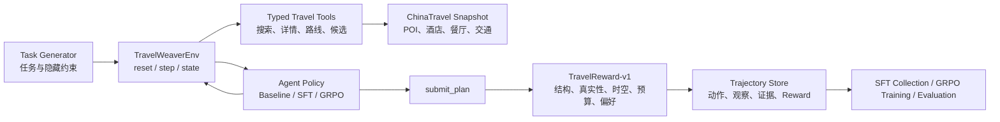

# TravelWeaver 项目设计记录

> Training Long-Horizon Travel Planning Agents with SFT and GRPO

> 查询环境的实施规范见 [TravelWeaverEnv 查询环境 MVP](travelweaver-env-mvp.md)，冻结的
> 评分边界见 [TravelWeaver Reward 与离线评估协议](reward-and-evaluation.md)。

## 1. 项目概述

TravelWeaver 是一个面向长程旅行规划的 Agentic RL 项目。项目计划以 [ChinaTravel](https://github.com/LAMDA-NeSy/ChinaTravel) 的离线旅行数据和约束验证器为基础，构建可回放、可验证、适合批量训练的旅行环境，并借鉴 [shopping-grpo-longhorizon](https://github.com/YYHDBL/shopping-grpo-longhorizon) 在工具环境、SFT 数据收集、GRPO 训练和 Reward 设计上的经验。

项目的主要目标不是立即解决生产部署和跨领域泛化，而是完成一个适合作为 Agentic RL 面试项目展示的端到端闭环：

1. Agent 能通过多轮工具调用收集旅行信息。
2. Agent 能组合并提交结构化多日行程。
3. 环境能确定性验证行程，而不是依赖 LLM 主观打分。
4. 可以生成 SFT 轨迹和 GRPO 训练任务。
5. 可以对 Baseline、SFT 和 GRPO 模型进行可复现对比。

项目名及命名约定：

- 项目名：`TravelWeaver`
- 仓库名：`travelweaver-agentic-rl`
- 模拟器：`TravelWeaverEnv`
- Python 包：`travelweaver`
- 模型命名：`TravelWeaver-SFT`、`TravelWeaver-RL`

## 2. 当前范围与关键决策

### 2.1 第一阶段范围

- 使用 ChinaTravel 的固定数据快照训练，不直接依赖实时网站和实时 API。
- 优先支持 ChinaTravel 已覆盖的 10 个城市。
- 优先完成单 Agent 的长程工具调用，不加入多 Agent 协作。
- 当前先稳定环境状态机、typed tools、可回放证据和确定性 Reward；训练代码随后接入。
- SFT 数据处理和 veRL/GRPO 集成在环境协议稳定后再实现。
- 模型与环境统一使用 OpenAI-compatible function calling，不引入 MCP。
- 暂不以生产可用性、全国城市覆盖和实时预订为目标。
- Tavily、Firecrawl、实时天气、实时车次和航班可以作为后续在线演示层，不进入第一版 RL 训练环境。

### 2.2 为什么使用离线模拟环境

直接使用真实环境可以做 Demo，但不适合作为主要训练环境：

- 搜索结果、价格和营业时间会持续变化，轨迹难以复现。
- API 限流、网络错误和付费调用会干扰 Reward。
- 同一任务的不同 rollout 无法保证面对相同世界状态，不利于 GRPO 的组内比较。
- 网站内容变化可能让旧训练数据失效。
- 大规模在线 rollout 成本高、速度慢。

固定快照不等于只能学习一个狭窄模板。领域多样性主要来自任务组合、城市组合、预算、人数、天数、偏好、交通方式和约束密度，而不是依赖环境每天变化。

推荐采用双层结构：

- 训练层：固定快照、确定性工具、可回放轨迹。
- 演示层：可选连接 Tavily、Firecrawl 和实时旅行 API。

## 3. ChinaTravel 能提供什么

ChinaTravel 当前数据大致包含：

| 数据类型 | 数量 |
|---|---:|
| 城市 | 10 |
| 景点 | 3,413 |
| 餐厅 | 4,655 |
| 酒店 | 4,124 |
| 航班 | 720 |
| 火车 | 5,770 |

公开任务大致包括：

| 数据集 | 数量 |
|---|---:|
| Easy | 300 |
| Medium | 150 |
| Human | 154 |
| Preference base | 50 |
| 6 组 Preference 任务 | 300 |
| Human1000 query-only 测试问题 | 1,000 |

可直接用于带完整约束验证的独立基础任务约为 654 条。Human1000 可以用于自然语言查询和最终测试，但公开版本缺少完整、可执行的 oracle 约束，不应直接作为 GRPO 训练任务。

ChinaTravel 最有价值的部分不是现有 Agent，而是：

- 旅行实体数据库；
- 城际交通数据；
- 市内路线计算；
- 开放时间和价格数据；
- 结构化输出格式；
- 环境真实性检查器；
- 时间、空间和用户硬约束验证器。

### 3.1 ChinaTravel 当前不足

ChinaTravel 的原始 `WorldEnv` 更像只读查询层，还不是完整 RL 环境：

- 没有标准的 `reset -> step -> reward -> done` 状态转移。
- 缺少原生 `submit_plan` 终止动作。
- 缺少每个 episode 的 Reward contract。
- 原始接口使用自由 Python 表达式和 `eval`，不适合直接暴露给训练模型。
- 官方评测主要面向批量 benchmark，不是逐步在线训练。
- `notedown -> plan` 将信息收集与最终规划拆给不同组件，不符合我们希望训练的端到端 Agent。

因此，TravelWeaver 应复用 ChinaTravel 的数据和验证逻辑，重写外围环境、动作协议、状态机和 Reward，而不是直接在原始 Agent 上训练。

## 4. 与 ShopSimulator 的比较

### 4.1 数据与训练规模

shopping-grpo-longhorizon 的公开记录大致为：

- 604 条原始教师轨迹；
- 428 条通过严格 `gold_purchase` 验证的轨迹；
- 379 条 SFT 训练轨迹；
- 49 条 SFT 验证轨迹；
- 1,000 条 GRPO 训练 prompt；
- 50 条 GRPO 验证 prompt；
- 每个 GRPO prompt 生成 4 个 rollout；
- 200 条独立测试任务。

README 中出现过“448 条训练数据”的表述，但项目文档和元数据对应的是 428 条通过验证的轨迹。

### 4.2 工具数量

ShopSimulator 向 Agent 暴露 13 个工具，其中 12 个是真正的环境动作，另一个是 `think`：

- 搜索与浏览：`search_products`、`open_product`
- 商品检查：`view_description`、`view_features`、`view_reviews`、`view_attributes`
- 选择规格：`select_option`
- 页面导航：`next_page`、`prev_page`、`back_to_search`
- 终止动作：`buy_now`、`finish_without_purchase`
- 内部推理：`think`

ChinaTravel 的 Agent 提示词中有 19 种动作，其中 17 个访问环境，另外两个是 `notedown` 和 `plan`。底层 `WorldEnv` 实际可调用 18 个环境函数，因为还存在一个没有写进 Agent 提示词的坐标查询函数。

ChinaTravel 的工具数量看起来更多，但 `*_keys`、`*_types` 和 `*_select` 拆分较细，数量不代表更强的环境交互能力。ShopSimulator 的优势是形成了完整的有状态闭环：

```text
搜索 -> 打开候选 -> 检查证据 -> 选择规格 -> 购买或退出 -> Reward
```

TravelWeaver 应形成对应闭环：

```text
搜索 -> 检查地点 -> 验证路线 -> 保存候选 -> 组合行程 -> 提交或退出 -> Reward
```

## 5. TravelWeaverEnv 工具设计

当前向 Agent 暴露 17 个 JSON Schema 工具，不暴露 Python lambda、`eval` 或任意代码执行。
类别/菜系/酒店特色目录是受类型约束的真实数据查询，不是数据库 schema 探测。

| 工具 | 作用 |
|---|---|
| `list_attraction_categories` | 查询城市当前可用景点类别 |
| `search_attractions` | 按城市、类型、价格等条件搜索景点 |
| `list_restaurant_cuisines` | 查询城市当前可用菜系 |
| `search_restaurants` | 按城市、菜系、推荐菜和价格搜索餐厅 |
| `search_restaurants_by_food` | 按推荐菜独立检索餐厅 |
| `list_hotel_features` | 查询酒店特色和房型床位数 |
| `search_hotels` | 按城市、房型、酒店特征和价格搜索酒店 |
| `search_intercity_transport` | 查询城市间火车或航班 |
| `search_nearby` | 查询某地点附近的景点、餐厅或酒店 |
| `inspect_place` | 获取地点详情、开放时间、价格及其他证据 |
| `check_place_open` | 核验地点在指定时刻是否开放 |
| `get_route` | 查询步行、出租车或地铁路线 |
| `next_page` | 获取当前结果的下一页 |
| `save_candidate` | 将可用候选加入 episode 状态 |
| `list_candidates` | 查看已保存候选及证据 |
| `remove_candidate` | 删除不再考虑的候选 |
| `submit_plan` | 提交结构化行程并触发终局验证 |

设计原则：

- 使用稳定 ID 引用景点、酒店、餐厅、车次和航班。
- 路线工具接受地点 ID，不要求模型精确复制自由文本名称。
- 工具参数通过 JSON Schema 校验。
- 工具只能访问当前 episode 允许看到的数据。
- Reward oracle 和隐藏约束不能暴露在 observation 中。
- `think` 不作为环境工具统计，也不依赖它训练。

## 6. 建议系统架构



每个 episode 至少需要保存：

- `task_id` 和数据快照版本；
- 对 Agent 可见的自然语言任务；
- 隐藏的结构化约束；
- 每一步工具名、参数和 observation；
- 新增证据和候选状态；
- 非法动作及拦截原因；
- 最终结构化计划；
- Reward 类型、总分和每个约束的证据明细；
- 终止原因和步数。

## 7. 数据构造方案

### 7.1 总体规模

当前建议：

- SFT：5,000 条通过严格验证的完整工具轨迹；
- GRPO：5,000 条训练 prompt；
- 每个 GRPO prompt 在线生成多个 rollout，而不是预先准备 5,000 条固定回答；
- 另设独立验证集和测试集，不计入上述 10,000 条训练数据。

“5K SFT”指 5,000 条 accepted trajectories，不是 5,000 条只有问题和最终答案的数据。

“5K GRPO”指 5,000 个任务 prompt。假设 group size 为 4，则一个完整训练周期最多可产生约 20,000 条 rollout；实际数量取决于 epoch、动态采样和失败重采样策略。

### 7.2 任务组合维度

可通过 DSL 组合以下变量生成任务：

- 起点城市和目标城市；
- 出行天数；
- 出行人数；
- 总预算；
- 房间数量和房型；
- 火车或飞机偏好；
- 市内交通偏好；
- 景点类别或指定景点；
- 餐厅菜系、推荐菜或指定餐厅；
- 酒店特征或指定酒店；
- 必须访问、禁止访问、至少一次、全部使用等逻辑；
- 出发或返回时间限制；
- 不同约束密度和难度等级。

ChinaTravel 的数据规模足以组合出 10K 任务，但必须控制近重复。仅替换城市名或预算数字不能被视为真正不同的任务。

### 7.3 数据切分原则

- 先按基础任务模板和约束组合切分，再进行自然语言改写。
- 同一逻辑任务的 paraphrase 不能跨训练集和测试集。
- 测试集保留未见过的约束组合，而不仅是未见过的句式。
- 可以进一步设置少量 city-holdout 或 route-holdout 测试。
- 训练 prompt 不携带 `hard_logic_py`、oracle 行程或最终可行候选。
- 所有 SFT 轨迹必须通过与训练时一致的 Reward 版本验证。

## 8. 可验证 Reward 设计

### 8.1 基本判断

TravelWeaver 可以做到与 ShopSimulator 同级别的确定性 Reward，而且可验证维度更多。不同之处是购物任务最终只选择一个商品，而旅行任务要验证多天、多活动、多路线组成的序列，因此验证器更复杂，Reward hacking 风险也更高。

TravelWeaver 不应该检查“是否生成了某一条标准答案”，而应该检查行程是否满足一组可执行属性，即 property-based verification。

### 8.2 可完全程序化验证的内容

- 输出是否符合 JSON Schema；
- 景点、餐厅、酒店、车次和航班是否存在；
- 引用的价格、时间、距离和路线是否与快照一致；
- 城际往返交通是否完整；
- 活动是否按时间顺序排列且不存在重叠；
- 相邻地点之间是否存在可行交通；
- 到达时间是否早于活动开始时间；
- 景点和餐厅是否处于开放时间；
- 酒店晚数、房间数和房型是否正确；
- 车票、机票、门票、房间及出租车数量是否正确；
- 总费用是否超过预算；
- 指定景点、菜系、酒店特征和交通方式是否满足；
- 每日餐饮、活动和住宿是否达到任务要求；
- 是否存在重复地点、无效绕行或遗漏行程。

以下主观概念不能直接作为严格 Reward：

- 浪漫；
- 松弛；
- 有趣；
- 体验丰富；
- 适合老人或儿童。

需要先将它们转换成确定代理条件，例如“每天最多三个景点”“连续步行不超过 2 公里”“每天保留至少 90 分钟休息时间”。无法转换的内容应只进入辅助 LLM 评测，不进入 GRPO 主 Reward。

### 8.3 TravelReward-v1 终局公式

Reward 核心只依赖统一 `TravelTaskSpec`，而不依赖 ChinaTravel 的任务字段。第一版对
激活的硬检查和软约束分别等权：`H=passed_hard/active_hard`，
`S=passed_soft/active_soft`。无软约束时 `S=1`。

- 基础设施或规格不可验证：`0.0` 且 `reward_valid=false`；
- 没有可评估提交：`-1.0`；
- 存在硬失败：`-1+H`，严格小于 `0`；
- 所有硬检查通过：`0.5+0.5×S`。

完整 TaskSpec、证据和 Judge 协议以
[Reward 与离线评估协议](reward-and-evaluation.md)为准。

必须区分两种失败：

- Agent 编造数据或输出非法结构：模型错误，应给负奖励。
- 环境文件缺失、验证器异常或必要证据损坏：基础设施错误，标记 `reward_valid=false`，从 GRPO 分组中剔除。

### 8.4 Reward 防作弊原则

- 不为普通搜索调用提供持续正奖励，避免 Agent 反复搜索刷分。
- 过程层主要负责非法动作拦截、循环检测和最大步数终止。
- 新证据进度应去重并设置上限。
- `submit_plan` 只能引用环境中存在的稳定 ID。
- 缺省字段不能被当作约束已经满足。
- 计划完整度必须作为硬门槛，避免提交只有一个景点的“极简合法计划”。
- 总费用由环境重新计算，不接受 Agent 自报总价。
- 路线、到达时间和活动衔接由环境重新计算。
- Reward 的任务约束在 rollout 前冻结，Agent 不能修改评分标准。
- Reward 需要版本化，例如 `travelweaver-reward-v1`。

### 8.5 与 ShopSimulator Reward 的对应关系

| ShopSimulator | TravelWeaver |
|---|---|
| `gold_purchase` | `strict_valid_plan` |
| `valid_alternative_purchase` | `feasible_plan` |
| `partial_alternative_purchase` | `partial_feasible_plan` |
| `wrong_purchase` | `invalid_plan` |
| `finish_without_purchase` | 无公开对应工具；未提交时由步数/非法动作终止 |
| `repeat_loop` | `repeat_loop` |
| `max_steps` | `max_steps` |
| `reward_unverifiable` | `reward_unverifiable` |

ChinaTravel 当前已有 schema、commonsense、hard constraints 和全通过率等评测指标，但不能直接把批量 Overall Score 当成单条训练 Reward。需要将检查器改造成逐 episode 返回结果，并为每条约束附带稳定的 ID、pass/fail/unverifiable 状态和证据。

## 9. 评估方案

Baseline、SFT、GRPO 使用相同测试任务、环境快照、工具协议和 Reward 版本。

核心指标建议包括：

| 指标 | 说明 |
|---|---|
| Schema Pass Rate | 最终计划结构合法率 |
| Environment Grounding Rate | 所有引用事实可由快照验证的比例 |
| Hard Constraint Pass Rate | 用户硬约束逐项通过率 |
| Strict Valid Plan Rate | 所有硬门槛和偏好全部通过的比例 |
| Feasible Plan Rate | 至少满足全部硬约束的比例 |
| Tool Call Validity | 工具名、参数和状态前置条件合法率 |
| Loop Rate | 重复动作或无进展终止比例 |
| Mean Steps | 完成任务平均工具调用步数 |
| Preference Score | 激活软偏好的平均满足率 |
| Reward Invalid Rate | 因环境或验证器问题无法评分的比例 |

建议报告：

- Baseline -> SFT 的增益；
- SFT -> GRPO 的增益；
- 不同任务难度下的成功率；
- 不同约束数量下的成功率；
- 工具调用长度与成功率关系；
- Reward 类型分布；
- 典型成功、约束失败、循环和 Reward hacking case study。

## 10. 实施路线

### 阶段一：环境骨架

- 建立 Python 项目结构；
- 固定 ChinaTravel 依赖版本和数据快照版本；
- 实现 `reset`、`step`、episode state、`done`；
- 定义统一 action、observation 和 trajectory schema。

### 阶段二：Typed Tools

- 将原始 ChinaTravel API 封装成类型化 JSON 工具；
- 移除 Agent 可控的 Python 表达式和 lambda；
- 加入 action guard、分页、候选状态和非法动作测试。

### 阶段三：提交与验证

- 实现结构化 `submit_plan`；
- 将 ChinaTravel 检查器改成单 episode 验证器；
- 为每个约束返回证据和错误原因；
- 实现 `TravelReward-v1` 和终止逻辑。

### 阶段四：任务生成

- 建立约束 DSL；
- 从数据库反向生成有解任务；
- 生成一定比例的无解和困难任务；
- 做重复检测、可解性检查和数据切分。

### 阶段五：SFT

- 用强模型生成教师轨迹；
- 只保留 `strict_valid_plan` 轨迹；
- 收集约 5,000 条 accepted trajectories；
- 完成 SFT 和验证集评估。

### 阶段六：GRPO

- 准备约 5,000 条训练 prompt；
- 先使用较小 group size 跑通端到端训练；
- 加入 reward-varying group 动态采样；
- 监控 Reward hacking、无效样本和长度膨胀。

### 阶段七：最终评估与 Demo

- 对比 Baseline、SFT、GRPO；
- 展示完整工具轨迹和 Reward breakdown；
- 可选增加实时搜索、网页抓取、天气和实时交通 Demo；
- 保持离线 benchmark 与实时 Demo 严格分离。

## 11. 主要风险

| 风险 | 缓解方式 |
|---|---|
| 任务看似 10K，实际大量近重复 | 按约束图和模板去重，不只做文本去重 |
| Agent 通过省略字段规避检查 | Schema completeness 和缺失字段 fail-closed |
| 过度奖励搜索行为 | 不提供可累积的正向工具 Reward |
| 自由文本名称产生歧义 | 使用稳定实体 ID 和结构化引用 |
| Reward 权重被模型利用 | 强硬门槛、版本化测试和 adversarial cases |
| ChinaTravel 原始 `eval/exec` 不安全 | 编译为受控谓词或结构化约束 AST |
| 训练和测试任务泄漏 | 先按语义模板及约束组合切分，再做改写 |
| 真实 API 破坏可复现性 | 训练固定快照，实时 API 只用于演示 |
| 主观旅行质量不可验证 | 转换成明确代理条件，或仅作辅助评测 |

## 12. 当前结论

1. ChinaTravel 足以作为 TravelWeaver 的数据世界和验证器基础。
2. 它不能原样充当训练环境，需要补齐状态机、typed tools、终止动作和逐 episode Reward。
3. 当前 17 个语义化工具保留目录发现、按菜品搜索和详情核验等不同决策阶段，同时合并同语义的附近搜索；这比逐函数照搬底层接口更适合 Agent 训练。
4. 5K 严格通过的 SFT 轨迹加 5K GRPO prompt 是合理的目标规模。
5. TravelWeaver 可以构建与 ShopSimulator 同级别的确定性 Reward，并拥有更丰富的时间、空间、预算和组合约束。
6. 旅行任务不存在唯一正确计划，应采用基于属性和约束的验证，而不是匹配单一 oracle 行程。
7. 第一版最重要的交付不是实时 API，而是一个稳定、可回放、可训练、可评估的完整闭环。

## 13. 待进一步确定

- 基础模型及参数规模；
- SFT 教师模型；
- GRPO group size、batch size 和最大轨迹长度；
- TravelReward-v1 的最终权重和分段值；
- 任务难度分布及无解任务比例；
- 是否直接复用 ChinaTravel 输出 schema，还是设计更精简的 itinerary schema；
- ChinaTravel 数据以依赖、子模块还是转换后快照的方式接入。
